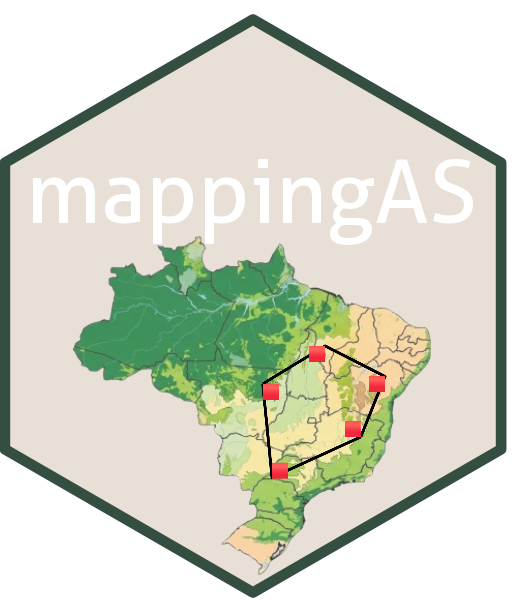

# mappingAS 

<!-- badges: start -->
[](https://github.com/lucasbarreirageo/mappingAS/actions/workflows/R-CMD-check.yaml)
[](https://lifecycle.r-lib.org/articles/stages.html#stable)
[](https://opensource.org/licenses/MIT)
[](https://doi.org/10.5281/zenodo.20570406)
[](https://app.codecov.io/gh/lucasbarreirageo/mappingAS?branch=main)
<!-- badges: end -->

> **mappingAS** — *Mapping Area of Species.* Geographic range metrics (EOO / AOO), MapBiomas habitat conversion and fire, and protected-area overlap for extinction-risk screening — from raw occurrence points to an interactive app and a written assessment report.

`mappingAS` is an R package, with an accompanying **Shiny** application, for screening species against **Criterion B** of the IUCN Red List. Starting from a set of occurrence points, it estimates each species' geographic range, measures how much of that range has been converted to anthropic land cover and how much has burned (using **MapBiomas**), quantifies the overlap with Brazil's federal protected areas, and packages everything for mapping, inspection, export and reporting. It feels familiar to anyone who has used [GeoCAT](https://geocat.iucnredlist.org/), while adding habitat-conversion, fire and protection layers driven by Brazil's national datasets.

> **Screening only.** The categories produced are **provisional** — they rest solely on the EOO/AOO *size* thresholds of Criterion B. They **do not replace** a formal IUCN assessment, which also requires the sub-conditions of fragmentation/few locations, continuing decline and extreme fluctuation.

---

## What it does

| Module | What you get | Key functions |
|---|---|---|
| **Occurrence import** | Read points from spreadsheets or spatial files, auto-detecting the species/lon/lat columns | `read_occurrences()` |
| **Range metrics** | Extent of Occurrence (EOO, convex hull) and Area of Occupancy (AOO, 2 km grid) on an equal-area projection, with provisional Criterion B categories | `assess_species()`, `calc_eoo()`, `calc_aoo()`, `iucn_category_B()` |
| **Habitat conversion** | % converted (anthropic) vs. natural within the EOO/AOO, plus the full per-class MapBiomas breakdown | `assess_species()`, `class_table()`, `plot_conversion()` |
| **Land-cover time series** | Composition (% × year, 1985–2024) as a MapBiomas-style stacked-area chart | `timeseries_for_species()`, `cover_timeseries()`, `plot_timeseries()` |
| **Fire** | % of the range burned at least once and burned-area time series, from MapBiomas Fire | `assess_species(fire = TRUE)`, `fire_timeseries_for_species()`, `plot_fire_timeseries()` |
| **Protected areas** | Overlap of occurrences/EOO/AOO with federal Conservation Units (UCs), incl. the natural-and-protected share | `assess_species(protected = TRUE)`, `pa_table()`, `plot_protection()`, `protected_areas()` |
| **Maps** | Interactive Leaflet map and a publication-ready static map (points + EOO + AOO + MapBiomas/fire) | `map_species()`, `map_static()` |
| **Interactive charts** | Every chart as an interactive plotly widget (hover, zoom) | `mas_plotly()` |
| **Reporting** | A written, referenced assessment report (HTML / text / **Word .docx**) | `assessment_report()` |
| **Export** | EOO/AOO polygons as **shapefile/GeoPackage** and MapBiomas **rasters (GeoTIFF)** | `export_ranges()` |
| **Interactive app** | A Shiny GUI that runs the whole workflow with no code | `run_app()` |

---

## Installation

```r
# install.packages("remotes")
remotes::install_github("lucasbarreirageo/mappingAS")
```

The core dependencies (`sf`, `terra`, `leaflet`, `DT`, `shiny`, `bslib`, `ggplot2`, `plotly`, `officer`, `readxl`) are installed automatically — including `officer`, so the Word report works out of the box.

The **local** MapBiomas backend uses **GDAL with `/vsicurl/`** (shipped with `terra`/`sf`), so **no Google Earth Engine account and no full national-mosaic download are needed** — only the window covering each species' range is read (and cached on disk).

The optional Earth Engine backend needs a configured `rgee`:

```r
install.packages("rgee")
rgee::ee_install()      # creates the Python environment
rgee::ee_Initialize()   # authenticates with your Earth Engine account
```

---

## Quick start

```r
library(mappingAS)

# 1. Read points (csv / xlsx / shp) — columns are auto-detected
occ <- read_occurrences("my_occurrences.xlsx")

# 2. Run the assessment. Turn on the optional modules as needed.
res <- assess_species(occ,
                      year = 2024, collection = 10, backend = "local",
                      mapbiomas = TRUE,   # habitat conversion (default)
                      fire      = TRUE,   # burned-area metrics
                      protected = TRUE)   # overlap with protected areas (UCs)

# 3. Inspect the summary table (one row per species)
res$summary

# 4. Map and charts
map_species(res)                    # leaflet: points + EOO + AOO + MapBiomas (+ fire, UCs)
plot_conversion(res)                # natural vs. converted, EOO and AOO
mas_plotly(plot_conversion(res))    # same chart, interactive

# 5. A written assessment report
cat(assessment_report(res, output = "text"))
assessment_report(res, output = "docx", file = "assessment.docx")

# 6. Export the ranges as spatial data
export_ranges(res)                    # mappingAS_EOO.shp + mappingAS_AOO.shp
export_ranges(res, format = "gpkg")   # one GeoPackage with eoo and aoo layers
export_ranges(res, zip = TRUE)        # bundled into a single .zip
```

### Bundled example

```r
ex  <- system.file("extdata", "example_occurrences.csv", package = "mappingAS")
res <- assess_species(read_occurrences(ex), backend = "local")
res
```

---

## The Shiny application

```r
library(mappingAS)
run_app()
```

Upload a file (`.xlsx`/`.csv`/`.gpkg`/`.geojson` or a shapefile in a `.zip`), map the columns if needed, choose the MapBiomas **year**, the AOO **cell size**, the **backend** (local / GEE) and which optional modules to run (**fire**, **protected areas**), then click **Assess**. The app is organised as tabs:

- **Map** — interactive Leaflet map (points, EOO, AOO, MapBiomas land use, fire, UCs) with downloads: interactive HTML, a **publishable PNG**, and the MapBiomas **land-use / fire rasters as GeoTIFF** (clipped to the selected EOO/AOO).
- **Results** — a visual overview per species (stat cards with in-line bars and IUCN category badges) plus a **column glossary** explaining every field, and the full table (CSV download).
- **Conversion** — interactive natural-vs-converted chart (EOO and AOO).
- **Classes** — area and % of every MapBiomas class inside the EOO/AOO (CSV download).
- **Protected areas** — overlap metrics, protection chart and the per-UC table (CSV download).
- **Time Series** — land-cover composition over time (interactive stacked area) for the EOO or AOO.
- **Fire** — burned-area metrics and time series.
- **Report** — an interpretive, referenced assessment that you can preview and download as **Word (.docx)**; it accumulates the temporal analysis from any Time series / Fire series you calculate.
- **Methods** — the methods and references behind the numbers.

A light/dark theme toggle is available in the header.

---

## Exporting ranges (shapefile / GeoPackage / raster)

`export_ranges()` writes the **EOO** and **AOO** polygons (one feature per species by default) with area, conversion and provisional-category attributes attached:

```r
export_ranges(res,
              dir    = "output",      # output directory
              format = "shapefile",   # or "gpkg"
              what   = "both",        # "eoo", "aoo" or "both"
              crs    = 4326,          # output CRS (WGS84 by default)
              aoo_as = "union",       # "union" (1 feature/species) or "cells"
              zip    = FALSE)         # TRUE = bundle everything into a .zip
```

Because the **ESRI Shapefile** format limits field names to 10 characters, the attribute table uses compact names (`species`, `eoo_km2`/`aoo_km2`, `n_cells`, `conv_pct`, `nat_pct`, `cat_B1`/`cat_B2`, `prov_cat`, `mb_year`, `mb_coll`). The **GeoPackage** (`format = "gpkg"`) stores both layers (`eoo`, `aoo`) in a single file with no field-name limit — the easiest option for QGIS/ArcGIS. By default, a `mappingAS_classes.csv` with the per-class composition is written too (`class_csv = FALSE` to skip).

The Shiny **Map** tab additionally exports the underlying **MapBiomas land-use and fire GeoTIFF rasters**, clipped to the selected species' EOO or AOO, as a `.zip`.

---

## Per-class composition and time series

```r
# Area and % of each MapBiomas class within the EOO and AOO
ct <- class_table(res)          # species x range (EOO/AOO) x class

# Land-cover composition over time (stacked-area chart, official MapBiomas colours)
ts <- timeseries_for_species(res, species = "sp1", range = "eoo", by = "class")
plot_timeseries(ts)
mas_plotly(plot_timeseries(ts))  # interactive

# Directly on any geometry
ts2 <- cover_timeseries(my_geometry, years = c(1990, 2000, 2010, 2020), by = "class")
```

Each year is read separately from MapBiomas (one GeoTIFF window per year), so an annual series across the whole collection can take a while; increase the year step to speed it up.

---

## Fire and protected areas

```r
# Fire: enable during assessment, then chart the burned-area series
res <- assess_species(occ, fire = TRUE)
fts <- fire_timeseries_for_species(res, species = "sp1", range = "eoo")
plot_fire_timeseries(fts)

# Protected areas (federal Conservation Units, ICMBio/INDE)
res <- assess_species(occ, protected = TRUE)
pa_table(res)         # per-UC overlap table
plot_protection(res)  # share of the range inside vs. outside UCs
```

With `protected = TRUE` **and** `mapbiomas = TRUE`, the summary also reports the habitat that is *both* natural *and* inside UCs (effectively protected natural habitat).

---

## The results table

Key columns (`res$summary`, also shown with a glossary in the app's **Results** tab):

| Column | Meaning |
|---|---|
| `species`, `n_records`, `n_unique` | Species; number of records and unique coordinates |
| `eoo_km2` | EOO in km² (`NA` if fewer than 3 unique points) |
| `aoo_km2`, `aoo_cells` | AOO in km² and number of occupied cells |
| `eoo_converted_pct` / `eoo_natural_pct` | % converted / natural within the EOO |
| `aoo_converted_pct` / `aoo_natural_pct` | % converted / natural within the AOO |
| `eoo_cat_B1`, `aoo_cat_B2`, `provisional_cat` | Provisional categories (size only) |
| `mapbiomas_year`, `mapbiomas_collection` | Land-cover source used |
| `eoo_burned_pct`, `aoo_burned_pct` | % of the EOO/AOO burned at least once *(fire = TRUE)* |
| `occ_in_uc_pct`, `eoo_uc_pct`, `aoo_uc_pct`, `n_uc` | Overlap with protected areas *(protected = TRUE)* |
| `eoo_nat_uc_pct`, `aoo_nat_uc_pct` | Share of the range that is natural *and* protected |

---

## Methods in brief

- **EOO** = area of the minimum convex polygon over the points (≥ 3 unique coordinates; otherwise `NA`), edges densified along great circles and measured on the WGS84 ellipsoid.
- **AOO** = number of occupied 2 × 2 km cells × 4 km² (cell size via `cell_km`), taken as the minimum over several translated grids.
- Areas are measured on a data-centred **LAEA equal-area** projection, in line with the IUCN guidelines.
- **Conversion**: MapBiomas classes are grouped into *natural*, *anthropic*, *water*, *not observed* and *other*. The headline index is `converted_pct = anthropic / (anthropic + natural) × 100` (terrestrial denominator; water and not-observed excluded by default — set `water_in_denominator = TRUE` to include water).
- **Criterion B thresholds** (screening only): EOO < 100 / 5,000 / 20,000 km² and AOO < 10 / 500 / 2,000 km² for CR / EN / VU.

---

## MapBiomas backends

- **`"local"` (default)** — reads, over the network, only the *window* of the national GeoTIFF via GDAL `/vsicurl/`. No Earth Engine account, no full-mosaic download. The windowed crop is cached on disk and reused for mapping and re-runs; map overlays use a fast decimated read.
- **`"gee"`** — computes per-class areas server-side on Google Earth Engine (recommended for very large, e.g. continental, ranges). Requires `rgee::ee_Initialize()`.

---

## Caveats and limitations

- The **categories are provisional** — they exclude fragmentation, decline and fluctuation.
- The **AOO is sensitive** to grid origin/placement and to sampling effort; the **EOO** can be inflated by outlying or erroneous records.
- The **local backend** streams the MapBiomas window over the network; for **very large (continental) ranges** prefer `backend = "gee"`.
- **MapBiomas accuracy** varies by class, biome and year — the classification of high-altitude grassland and rocky-outcrop mosaics is of lower accuracy; consult the official documentation.

---

## Citation

When using this package, please also cite the underlying data and methods:

- **MapBiomas** — Projeto MapBiomas, Collection 10 (land use/cover) and Fire Collection 4 (<https://brasil.mapbiomas.org>).
- **IUCN** — Standards and Petitions Committee. *Guidelines for Using the IUCN Red List Categories and Criteria.*
- **GeoCAT** — Bachman, S. *et al.* (2011). *Supporting Red List threat assessments with GeoCAT.* ZooKeys 150: 117–126.
- **ICMBio / INDE** — Federal Conservation Units geoservice.

---

## Licence
MIT © Antônio Lucas Barreira. See the [`LICENSE`](LICENSE) file.
